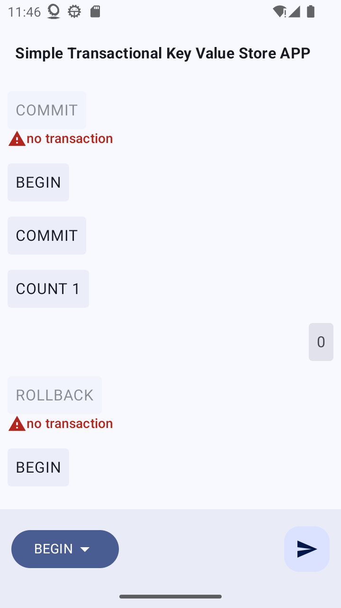
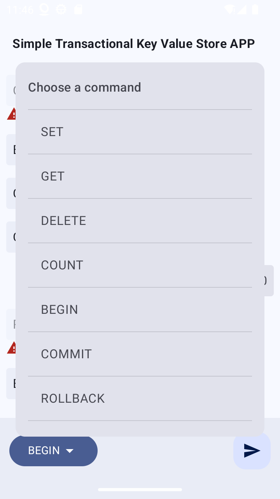

# Simple Transactional Key-Value Store APP

This repository contains an implementation of a technical assignment for TrustWallet. The assignment required creating a simple transactional key-value store with multithreading support, designed using clean architecture principles, and providing a user interface where users can execute various commands.

## Features

- **Transactional Support**: Begin a transaction, perform operations within that transaction, and either commit or rollback changes.
- **Multithreading**: The solution is designed to be thread-safe, allowing for concurrent transactions and operations.
- **Interactive UI**: The app includes a user interface built with Jetpack Compose, allowing users to select commands and input values through an interactive command-line-like interface.
- **Core Operations**: The app supports basic key-value operations like `SET`, `GET`, `DELETE`, and `COUNT`.

## Getting Started

### Prerequisites

- Android Studio Flamingo or later.
- Android SDK 33 or higher.
- Java 11 or higher.

### Installation

1. Clone the repository:

   ```bash
   git clone https://github.com/mastahnish/TrustWalletExercise.git
   cd TrustWalletExercise
   ```

2. Open the project in Android Studio.

3. Build the project using the Gradle wrapper.

4. Run the app on an emulator or a physical device.

## Usage

1. **Begin a Transaction**: Click on the `BEGIN` button to start a new transaction. All subsequent operations will be part of this transaction.

2. **Perform Operations**: Use the command selector at the bottom of the interface to choose commands like `SET`, `GET`, `DELETE`, or `COUNT`, and provide the necessary inputs.

3. **Commit or Rollback**: Once you have performed the desired operations, you can either commit the transaction to make the changes permanent or rollback to discard them.

## Example

Here is a simple example of how to use the app:

1. Begin a transaction by clicking `BEGIN`.
2. Use the `SET` command to add a key-value pair.
3. Retrieve the value using `GET`.
4. If satisfied, commit the transaction using `COMMIT`. If not, rollback using `ROLLBACK`.

## Screenshots




## Design Choices

- **Thread Safety**: The storage mechanism supports concurrent access, making the application safe to use in multithreaded environments.
- **Data Structures**: The choice of data structure for the underlying storage was made to balance performance and simplicity. The details of this choice can be discussed further upon request.
- **Clean Architecture**: The app is designed using clean architecture principles, separating concerns between data handling, business logic, and UI.
- **Modularization**: There is basic modularization done to showcase the logic split for key-value processing that can be found in separate module - `kv_store`

## Notes

- The app interface is intentionally designed to demonstrate clean architecture, even though it might seem a bit over-engineered for a simple key-value store.
- Transactions in this app work as follows: when a `BEGIN` command is issued, subsequent `SET`, `GET`, and `DELETE` operations are counted towards this transaction. The transaction can be finalized with a `COMMIT` or reverted with a `ROLLBACK`.

## Additional Information

- The `BEGIN` command starts a transaction, and all subsequent `SET`, `GET`, and `DELETE` operations are included in this transaction. The transaction can then be finalized with a `COMMIT` or reverted with a `ROLLBACK`.
- If a transaction is not active, any command executed (`SET`, `GET`, `DELETE`) is performed immediately and cannot be undone.


